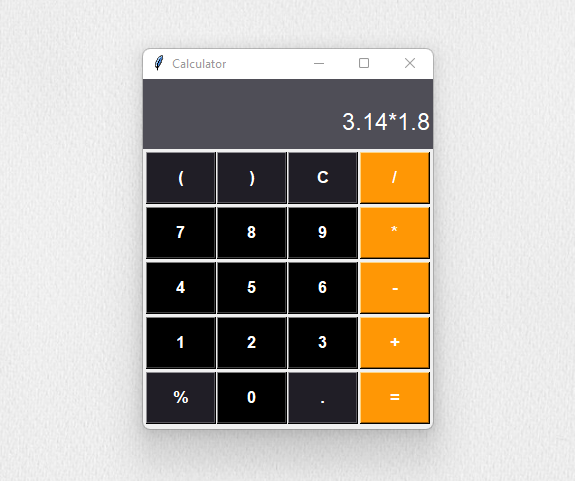

<h1 align="center"> Calculadora </h1>

Calculadora desenvolvido para fins didáticos, para agregar conhecimento.

  <a href="#-tecnologias">Tecnologias</a>&nbsp;&nbsp;&nbsp;|&nbsp;&nbsp;&nbsp;
  <a href="#memo-licença">Licença</a>

  

 

  

## 🚀 Tecnologias

Esse projeto foi desenvolvido com as seguintes tecnologias:

- Python e Tkinter
- Git

## 💻 Projeto

Calculadora simples e bonita com várias operações.

## :memo: Licença

Esse projeto está sob a licença MIT.
